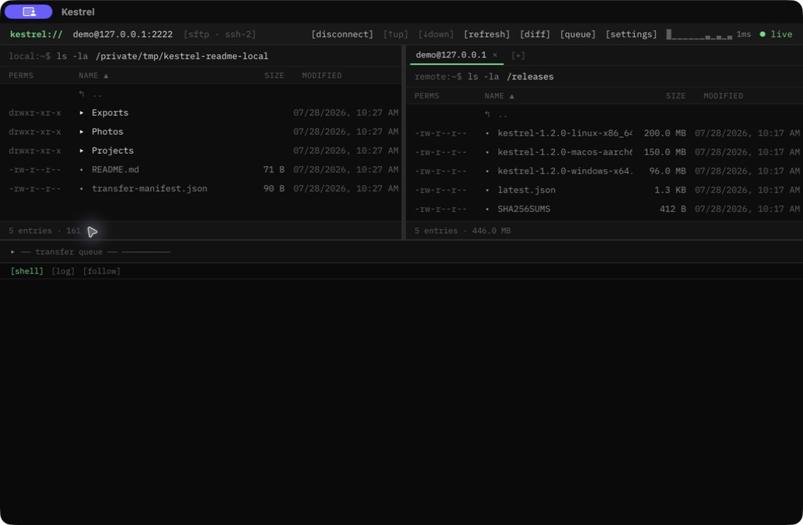
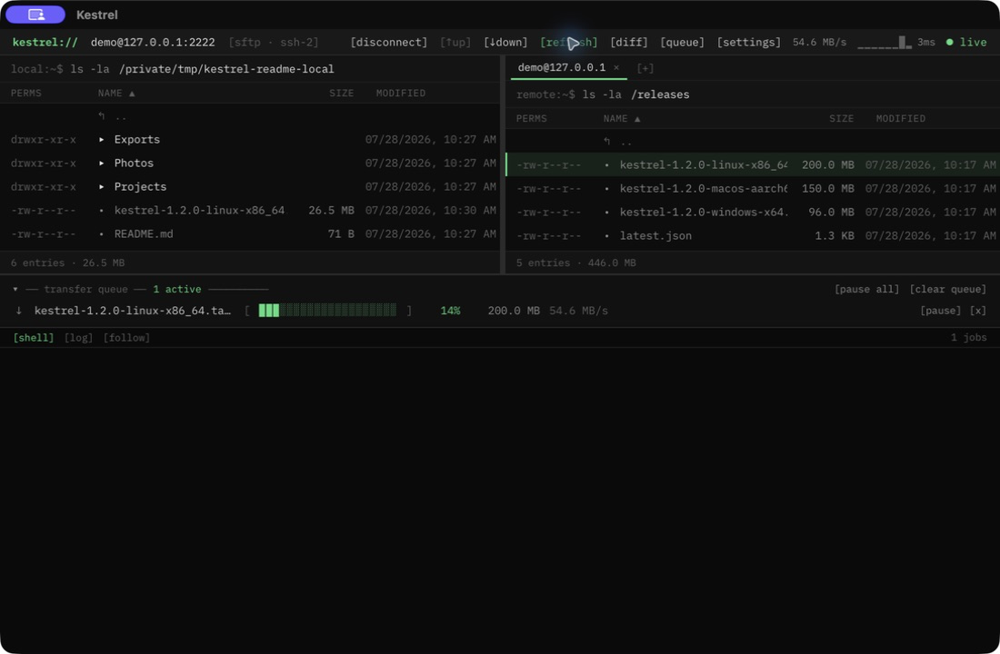
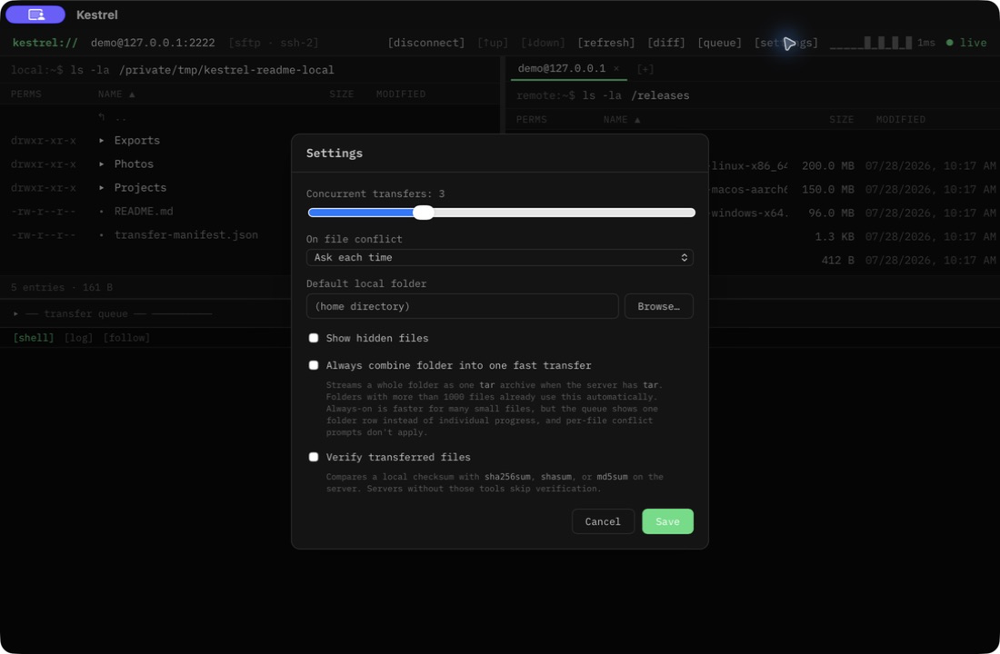

# Kestrel

Kestrel is a cross-platform SFTP client with a fast dual-pane workflow, a durable transfer queue, and an interactive SSH shell. It is built with Tauri 2, a headless Rust transfer engine, and Svelte 5.



> **Project status:** pre-1.0. Kestrel is under active development; build it from source for the most current version.

## Highlights

### Browse without losing context

- Local and remote files stay visible side by side.
- Expand folders inline or navigate directly with editable path fields.
- Sort, filter, multi-select, drag between panes, and drop local OS files to upload.
- Rename, move, delete, create folders, and edit Unix permissions on either side.
- Compare pane contents with diff mode and send only differing files.
- Keep multiple remote sessions open in tabs.

### Move large file sets confidently

- Run concurrent uploads and downloads with live progress and throughput.
- Pause, resume, retry, cancel, or clear the entire queue.
- Resume partial downloads and persist unfinished queue items across restarts.
- Transfer folders recursively, with automatic tar streaming for very large trees.
- Resolve destination conflicts by skipping, keeping both, resuming, or overwriting.
- Optionally verify completed files with checksums.
- Refresh affected panes automatically when transfers finish.



### Work on the remote host

- Open a real PTY-backed SSH shell without leaving the file browser.
- Follow the shell's working directory in the remote pane.
- Search remote trees and reveal results in place.
- Open a remote file in the local default editor and sync saved changes back.
- Encode supported media on the remote host from the file context menu.

### Connect securely

- Authenticate with a password, private key, `ssh-agent`, or keyboard-interactive prompts.
- Verify unknown hosts with a trust-on-first-use fingerprint prompt.
- Reject changed host keys as a potential man-in-the-middle event.
- Save bookmarks while keeping secrets in the operating system credential store.
- Reconnect dropped sessions and resume recoverable transfers automatically.

## Settings

Tune queue concurrency, the default conflict policy, the starting local folder, hidden-file visibility, tar acceleration, and post-transfer verification.



## Architecture

```text
crates/engine/   Rust session, filesystem, search, and transfer engine
src-tauri/       Thin Tauri command, DTO, settings, keyring, and event layer
src/             SvelteKit frontend and component/store tests
e2e/             WebdriverIO smoke tests through tauri-driver
docs/            Benchmarks, release notes, and screenshots
```

Two boundaries keep the application responsive and testable:

- **File bytes never cross IPC.** Tauri commands carry paths and metadata; Rust performs disk and network I/O. Progress reaches the webview as batched events.
- **The engine has no Tauri dependency.** Sessions and transfers can be tested headlessly against the bundled in-process SSH/SFTP server.

## Security model

- Unknown host keys require an explicit trust decision. Changed keys hard-fail and are never silently replaced.
- Passwords and passphrases are zeroized in Rust, redacted from debug output, excluded from logs and bookmark files, and stored only in the platform credential manager when requested.
- Download paths reject traversal, absolute components, embedded separators, control characters, and Windows-reserved names.
- Symlinks are displayed but never followed during recursive transfers.
- Downloads are written to `<name>.part`, synced, and atomically renamed on completion. The partial length is also the resume offset.

## Build from source

### Prerequisites

- Rust stable
- Node.js 20 or newer
- [pnpm](https://pnpm.io/)
- The [Tauri 2 platform prerequisites](https://tauri.app/start/prerequisites/) for your operating system
- Windows x86_64: [NASM](https://www.nasm.us/) on `PATH` for the `aws-lc-sys` dependency

### Run or bundle the app

```bash
pnpm install
pnpm tauri dev
pnpm tauri build
```

## Local demo server

The repository includes the seeded SFTP server used for the screenshots and integration tests. It requires no Docker or external network.

```bash
cargo run -p kestrel-engine --example demo_server
```

Then connect Kestrel with:

```text
Host:      127.0.0.1
Port:      2222
Username:  demo
Password:  demo
```

The server creates a temporary remote tree with folders, small files, and large release artifacts suitable for exercising progress, pause/resume, and queue behavior.

## Development checks

```bash
pnpm check
pnpm lint
pnpm test
cargo test --workspace
cargo clippy --workspace --all-targets -- -D warnings
```

The optional end-to-end suite runs against a built application through `tauri-driver` on Linux and Windows:

```bash
pnpm tauri build
pnpm test:e2e
```

Transfer benchmark notes and caveats live in [docs/benchmarks.md](docs/benchmarks.md). Release setup and signing requirements are documented in [docs/RELEASING.md](docs/RELEASING.md).

## Scope

Kestrel currently targets desktop SFTP. Folder synchronization, dragging remote files directly out to Finder or Explorer, additional storage protocols, and mobile clients are outside the current scope.

## License

MIT
