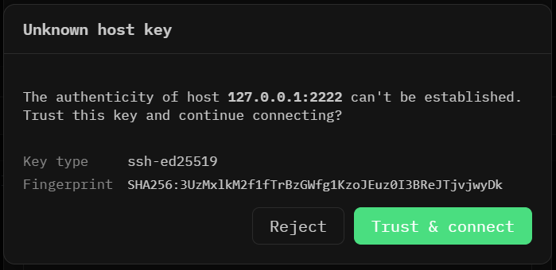
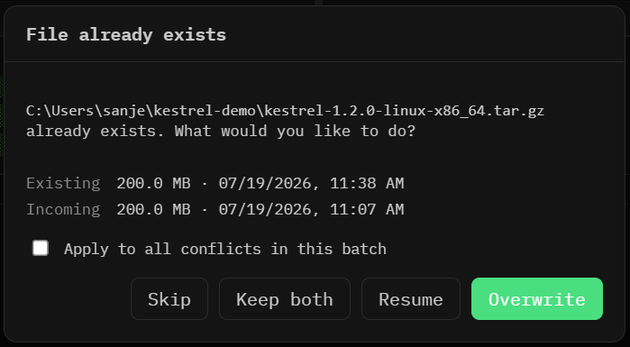

# Kestrel

A cross-platform SFTP file-transfer client — dual-pane browsing, a real transfer
queue, and an SSH shell, in a native desktop app. Built with Tauri v2, a Rust
transfer engine, and Svelte 5.


> **Status: pre-1.0, no published binaries yet.** Everything below is
> implemented and tested, but release signing and the update feed are not set up
> (see [Releases](#releases)), so today you build from source. The app is also
> still shipping under its working name — the window title and `kestrel://` bar
> say Kestrel, while the bundle identifier and crate names remain `sftpapp`.

## Features

**Connect**

- Password, private key, ssh-agent, and keyboard-interactive authentication
- Bookmarks, with secrets kept in the OS credential store (Keychain / Windows
  Credential Manager / Secret Service) rather than in config files
- Host-key verification against `known_hosts`, with a trust-on-first-use prompt
- Automatic reconnect when a session drops

**Browse**

- Dual-pane local/remote layout with a resizable split
- Expand directories in place, or navigate into them
- Rename, move, delete, mkdir, and chmod on both sides
- Local pane auto-refreshes when the directory changes on disk

**Transfer**

- Concurrent transfers (3 at a time by default) with per-file progress and
  throughput
- Pause, resume, retry, and cancel — individually or for the whole queue
- Recursive directory transfers, with optional tar acceleration
- Conflict prompts (skip / keep both / resume / overwrite), applicable per file
  or to a whole batch
- Drag and drop between panes, and from the OS into the window
- The queue survives an app restart, and partial downloads resume from where
  they stopped

**Beyond transfers**

- An interactive SSH shell with a real PTY, in a terminal pane
- Edit-and-sync: open a remote file in your local editor and have saves upload
  automatically
- Optional post-transfer integrity verification

### Not in v1

SFTP is the only protocol — though all remote access goes through a
protocol-agnostic trait, so FTP/WebDAV/S3 can be added without a redesign.
Also out of scope: folder sync, dragging files _out_ to Finder/Explorer (Tauri
can't), and mobile.

## Screenshots

Concurrent downloads, with live progress, throughput, and per-file controls:


Unknown hosts block on a trust-on-first-use prompt showing the key fingerprint.
A host key that _changed_ is never offered like this — it hard-fails with a MITM
warning, and replacing it takes an explicit destructive confirmation:



Conflicts are surfaced rather than guessed at:



## Security

The invariants the code is written against:

- **Host keys.** An unknown host blocks on a TOFU prompt. A _changed_ key
  hard-fails with a MITM warning and is never default-accepted; replacing it
  requires explicit destructive confirmation.
- **Secrets.** Passwords and passphrases live in `zeroize::Zeroizing<String>` on
  the Rust side and are dropped after use. Wrapper types redact themselves in
  `Debug`. Secrets never reach logs, never land in `bookmarks.json`, and are
  never held in JS stores — dialog-local component state only, cleared on close.
- **Download paths.** When recreating a remote tree locally, every remote path
  component is validated: no `..`, absolute components, embedded separators,
  NUL/control characters, or Windows-reserved names. After joining, the
  canonicalized destination is asserted to still be under the destination root.
- **Symlinks.** Shown in listings with their target, but never followed;
  recursive transfers skip them and log a notice.
- **Downloads are atomic.** Bytes go to `<name>.part`, are fsynced, then renamed
  into place. The `.part` length doubles as the resume offset.

## Architecture

```
crates/engine/   Rust transfer + session engine (no Tauri dependency)
src-tauri/       Tauri shell: IPC commands, DTOs, settings, keyring access
src/             Svelte 5 frontend (runes; SvelteKit in static SPA mode)
e2e/             WebdriverIO smoke test, driven through tauri-driver
```

Two rules shape the layout:

- **No file bytes cross IPC.** Tauri commands carry paths and metadata only; all
  disk and network I/O happens in Rust. Progress reaches the webview as batched
  events at ≤10 Hz total.
- **The engine stays Tauri-free.** `crates/engine` must not depend on `tauri` —
  IPC and DTO types live in `src-tauri`. This keeps the engine testable
  headless, which is how most of the test suite runs.

## Building from source

**Prerequisites**

- Rust (stable) and the [Tauri v2 system
  dependencies](https://tauri.app/start/prerequisites/) for your platform
- Node 20+ and pnpm
- **Windows:** [NASM](https://www.nasm.us/) on `PATH`. `russh` pulls in
  `aws-lc-sys`, which assembles its crypto primitives with NASM on x86\_64 and
  hard-fails the build without it.
- **Linux:** `libwebkit2gtk-4.1-dev`, `libgtk-3-dev`,
  `libayatana-appindicator3-dev`, `librsvg2-dev`, `patchelf`, `build-essential`,
  `libssl-dev`

```bash
pnpm install
pnpm tauri dev            # run the app
pnpm tauri build          # produce a release bundle
```

### Development

```bash
pnpm check                # Svelte + TypeScript typecheck
pnpm lint                 # prettier + eslint
pnpm test                 # frontend unit tests (vitest)
cargo test --workspace    # Rust tests
cargo clippy --workspace --all-targets -- -D warnings
```

### Testing against a real server

Most engine tests drive an in-process russh SSH+SFTP server on localhost — no
Docker, no network. The same harness backs a demo server you can point the app
at:

```bash
cargo run -p sftpapp-engine --example demo_server
# serves 127.0.0.1:2222 as demo/demo, with a seeded file tree
```

Two further suites need real infrastructure:

```bash
# Fidelity tests against a real OpenSSH server (permissions, non-ASCII names,
# key auth, a 100 MB transfer). Skipped unless the feature and env are set.
docker run -d -p 2222:22 atmoz/sftp user:pass:::upload
SFTP_TEST_HOST=127.0.0.1 SFTP_TEST_PORT=2222 SFTP_TEST_USER=user \
  SFTP_TEST_PASS=pass SFTP_TEST_DIR=/upload \
  cargo test -p sftpapp-engine --features docker-tests

# End-to-end smoke test against the built app. Linux/Windows only —
# tauri-driver has no macOS support. Needs `cargo install tauri-driver`.
pnpm tauri build && pnpm test:e2e
```

## Performance

A 256 MB download through the engine measured **84.3 MB/s** (3.04 s) over
loopback — see [docs/benchmarks.md](docs/benchmarks.md).

Read that number narrowly. It was taken against a containerized server over
loopback with ~0 ms RTT, where the emulation layer was the likely bottleneck.
Because there is no round-trip latency on loopback, it does _not_ exercise the
thing actually worth measuring: `russh-sftp`'s high-level reader issues
sequential read requests without pipelining, which can cap single-file
throughput as RTT rises. A high-RTT benchmark is still outstanding. The read
path is isolated in `crates/engine/src/transfer/io.rs`, so overlapping reads can
be added there if that measurement ever shows a shortfall.

## Releases

There are none yet. The release pipeline, updater configuration, and signing
setup exist, but the signing secrets and a real update endpoint are not yet
installed — the configured updater endpoint is still a placeholder. See
[docs/RELEASING.md](docs/RELEASING.md) for the process and the pre-release
checklist.

## License

MIT
